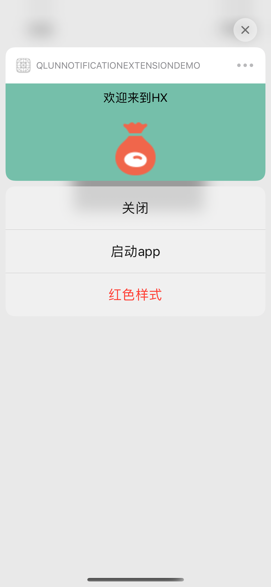
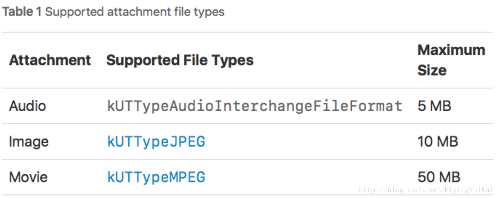

## QLUNNotificationExtensionDemo
> 主要测试推送通知的 ContentExtension 和 ServiceExtension。
> 

### 效果图

<div align = "center">
 </div>
<br>

### 一. ContentExtension
 
 > 主要可以自定义一个 更大的 通知栏提示
 
#### i). pilst文件标注

```
<plist NSExtension>
<dict>
	<key>NSExtensionAttributes</key>
	<dict>
		<key>UNNotificationExtensionCategory</key>
		// 可为NSString / Arr
		<array>
			<string>category1</string> // 与内部代码注册一致，显示的按钮等，可自行查看demo中的AppDelegate注册。
			<string>category2</string>
		</array>
		<key>UNNotificationExtensionInitialContentSizeRatio</key>
		<real>0.4</real> // 初始化时的横竖比 ( 高 / 宽 )
		<key>UNNotificationExtensionDefaultContentHidden</key>
		<string>YES</string> // 是否隐藏原来的弹框 可以自行尝试，在UI上有所表现
	</dict>
	<key>NSExtensionMainStoryboard</key>
	<string>MainInterface</string>
	<key>NSExtensionPointIdentifier</key>
	<string>com.apple.usernotifications.content-extension</string>
</dict>
</plist>

```

#### ii). 修改UI大小

```
// 修改大小
self.preferredContentSize = CGSizeMake([UIScreen mainScreen].bounds.size.width, 140);
```

### 二. ServiceExtension
 
 > 主要是可以在iphone展示推送效果之前对APNs的数据进行处理，然后再进行展示。
 
 ```
 // 在这接受传过来的数据
 - (void)didReceiveNotificationRequest:(UNNotificationRequest *)request withContentHandler:(void (^)(UNNotificationContent * _Nonnull))contentHandler {}
 ```
 
#### 文件大小限制
<div align = "center">
 </div>
<br>

- 一定要有 `"mutable-content": "1"`,以及一定要有 `Alert` 的字段，否则可能会拦截通知失败。

```
{
    "aps": {
        "alert": "This is some fancy message.",
        "badge": 1,
        "sound": "default",
        "mutable-content": "1",
        "imageAbsoluteString": "http://upload.univs.cn/2012/0104/1325645511371.jpg"

    }
}
```
